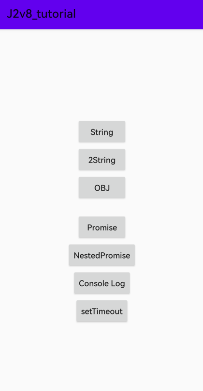

# J2V8_tutorial

J2V8 tutorial on Android.
- Simple call JavaScript method.
- Call a method that returns a promise.
- Made two native plugins(`console`,`setTimeout`)
## Usage
### Package js
```shell
cd js
npm install
./node_modules/.bin/webpack --config webpack.config.js
```
### Android
### init

```kotlin
J2V8Helper.init(this, "example.js", "libExample")
```
### run

```kotlin
// run method returns with normal type.
J2V8Helper.runJS(moduleName, funName, params)

// run method returns with [Promise] type.
J2V8Helper.runJSPromise(moduleName, funName, params)
```
## Snapshot



## Environment

npm 6.14.17

node.js v14.20.0

